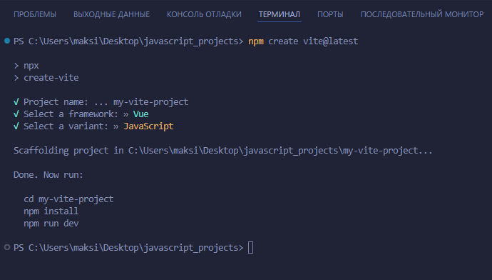
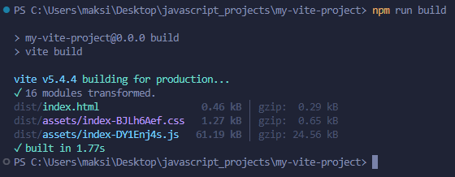
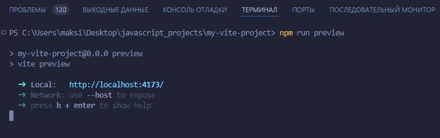

# Vue 3 + Vite

This template should help get you started developing with Vue 3 in Vite. The template uses Vue 3 `<script setup>` SFCs, check out the [script setup docs](https://v3.vuejs.org/api/sfc-script-setup.html#sfc-script-setup) to learn more.

Learn more about IDE Support for Vue in the [Vue Docs Scaling up Guide](https://vuejs.org/guide/scaling-up/tooling.html#ide-support).


**Vite** — это современный инструмент для сборки фронтенд-проектов, разработанный для повышения скорости и улучшения опыта разработки.

**Название "Vite" (произносится как "вит") на французском языке означает "быстро".**

**Основная цель Vite** — обеспечить высокую скорость сборки и перезагрузки на этапах разработки, особенно для крупных проектов. **Он был создан создателем Vue.js, Эваном Ю.**

### Создание проекта на Vite

1. **Откройте терминал или командную строку.**

2. **Выполните следующую команду для создания нового проекта с помощью Vite:**
```bash
npm create vite@latest
```



3. **Система предложит выбрать имя для проекта. Введите имя проекта (например, `my-vite-project`).**

4. Затем вам будет предложено выбрать шаблон проекта (например, `Vanilla`, `Vue`, `React`, `Svelte` и другие). 

**Выберите тот, который вам нужен, например:**

- **vanilla** (чистый `JavaScript` проект)
- **vue** (если вы хотите использовать `Vue.js`)
- **react** (если хотите использовать `React`)

**Пример выбора шаблона Vue:**
```
? Select a framework: » - Use arrow-keys. Return to submit.
  Vanilla
  Vue
  React
  ...
```

5. **Перейдите в папку с созданным проектом:**
```bash
cd my-vite-project
```

6. **Установите зависимости, выполнив:**
```bash
npm install
```

### 3. Запуск проекта

**Запустите проект на локальном сервере разработки:**
```bash
npm run dev
```

Теперь Vite запустит сервер разработки, и вы сможете перейти по адресу, указанному в консоли (обычно это `http://localhost:5173`), чтобы увидеть свой проект.

### 4. Структура проекта

**После создания проекта структура будет выглядеть примерно так:**

```
vite-project/
├── index.html            # Главный HTML-файл
├── package.json          # Информация о проекте и зависимости
│
├── src/                  # Исходный код
│   ├── main.js           # Точка входа приложения
│   └── App.vue (если выбрано Vue)
│
└── vite.config.js        # Конфигурационный файл Vite
```

### 5. Дополнительно

**Создание сборки для продакшн:** Когда проект будет готов для публикации, выполните команду.

```bash
npm run build
```

- Эта команда создаст оптимизированную версию проекта в папке dist.



**Запуск предварительного просмотра продакшн-версии:**

```
npm run preview
```



Теперь у вас есть базовый проект на Vite, который можно расширять в зависимости от ваших требований.


**Преподаватель:** Дуплей Максим Игоревич

**Дата:** 12.09.2024

**Версия 1.0**
